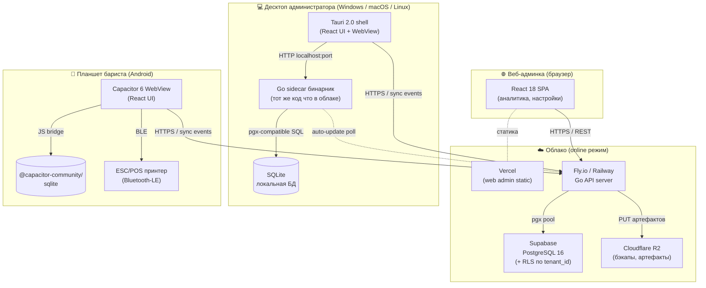
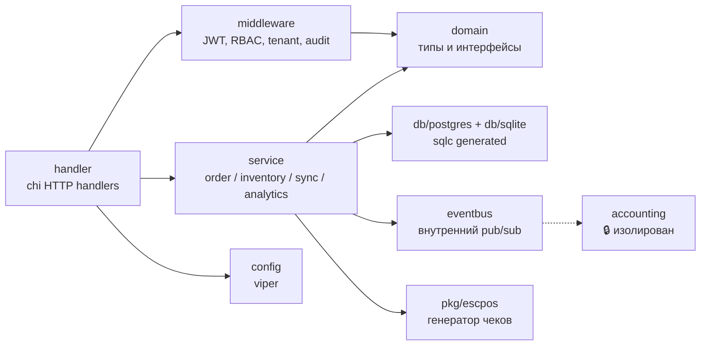
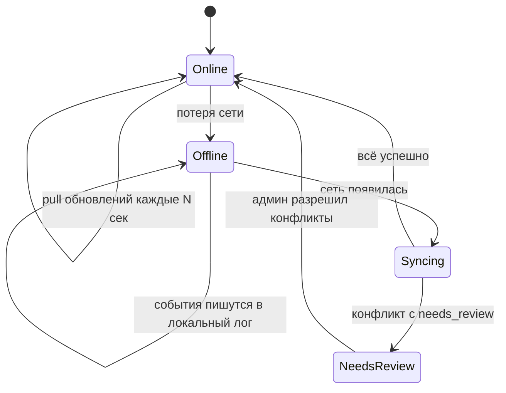

# 1. Диаграмма компонентов системы

## 1.1 Общая картина

Система состоит из **трёх клиентов** (десктоп администратора, планшет
бариста, веб-админка) и **одного Go-сервера** в облаке. Все клиенты могут
работать офлайн с локальной SQLite, и при появлении сети синхронизируются
с центральным PostgreSQL через REST + event sourcing.



## 1.2 Логические слои внутри Go-сервера

Каждая стрелка показывает разрешённое направление импорта. **Бухгалтерия
изолирована** — её импортирует только сам main, и только если флаг
`accounting.enabled = true`. Никакой другой пакет на неё не ссылается.



**Ключевое:** `service` никогда не импортирует `accounting`. Бухгалтерия
подписывается на события через `eventbus` и работает асинхронно. Если её
выключить в конфиге — `main.go` просто не регистрирует подписчиков.

## 1.3 Режимы работы клиента



В UI режим показывается одной из 4 иконок:
- 🟢 **Online** — последний push прошёл < 30 сек назад.
- 🔴 **Offline** — нет соединения, события копятся локально.
- 🔄 **Синхронизируется** — идёт push/pull.
- ⚠️ **Несинхронизировано (N)** — есть события, ждущие отправки, или
  непросмотренные конфликты с флагом `needs_review`.

## 1.4 Поток продажи (касса бариста, офлайн)

```mermaid
sequenceDiagram
    autonumber
    participant U as Бариста (UI)
    participant Z as Zustand store
    participant SQ as SQLite (local)
    participant P as ESC/POS принтер
    participant G as Go sidecar / cloud
    participant PG as PostgreSQL

    U->>Z: выбор товара + модификаторы
    Z->>SQ: read products, recipes, stock
    Z-->>U: цена, доступность (стоп-лист)
    U->>Z: оплата (Kaspi QR + наличные)
    Z->>SQ: INSERT order, order_items, payments, stock_movements<br/>(в одной транзакции, с client_uuid)
    SQ-->>Z: ok
    Z->>P: печать ESC/POS чека
    Z->>SQ: INSERT sync_events (тип: ORDER_CREATED)

    Note over Z,G: ↓↓↓ Когда появится сеть ↓↓↓

    Z->>G: POST /api/sync/push [events...]
    G->>PG: BEGIN; INSERT ... ON CONFLICT (client_uuid) DO NOTHING; COMMIT
    G-->>Z: { accepted: [...], conflicts: [...] }
    Z->>G: GET /api/sync/pull?since=...
    G-->>Z: новые цены / меню / остатки
    Z->>SQ: применить pull-обновления
```

## 1.5 Развёртывание (онлайн vs офлайн установка)

| Артефакт | Что внутри | Куда копируется | Как запускается |
|---|---|---|---|
| `coffeeshop-pos-x64.exe` | Tauri + Go sidecar + SQLite | флешка → Windows ПК | двойной клик, NSIS установщик |
| `coffeeshop-pos.dmg` | Tauri + Go sidecar + SQLite | флешка → macOS | drag-n-drop в Applications |
| `coffeeshop-pos.AppImage` | Tauri + Go sidecar + SQLite | флешка → Linux | `chmod +x && ./` |
| `coffeeshop-pos.apk` | Capacitor WebView + JS bundle | OTG-флешка → планшет | установка из неизвестных источников |
| `server-linux` (опц.) | Go бинарник | свой сервер на месте | `systemd unit` или `docker compose up` |

В режиме **«всё на месте»** (например, нестабильный интернет в локации):
- На ноутбуке администратора крутится `server-linux` + локальный PostgreSQL
  (через Docker Compose или systemd).
- Планшеты и Tauri-десктоп ходят на ноутбук по локальной Wi-Fi сети.
- Облачный Supabase используется только для офсайт-бэкапов раз в сутки.

## 1.6 Открытые вопросы к владельцу

1. **Чеки гостю — нужен ли QR с детализацией заказа?** (по умолчанию нет.)
2. **Печать**: на каждой кассе свой Bluetooth-принтер, или один LAN-принтер
   на точку? Это меняет UX выбора устройства в настройках.
3. **Сеть на точке**: нужен ли режим «локальный сервер на ноутбуке +
   планшеты по LAN» из §1.5, или достаточно облака + офлайн-кэша?
4. **Сколько одновременных кофеен (tenants) планируется на старте?** От
   этого зависит, разворачивать ли PostgreSQL self-hosted или сразу Supabase.
5. **Kaspi QR**: интеграция через Kaspi API или просто фиксация факта
   оплаты вручную бариста? (API требует договор с банком.)
6. **Авто-обновление десктопа**: Tauri Updater подписывает артефакты —
   нужен ли self-signed ключ или будем без подписи (как Windows SmartScreen)?
