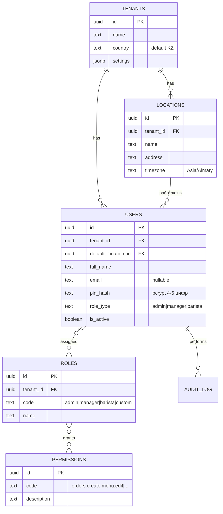
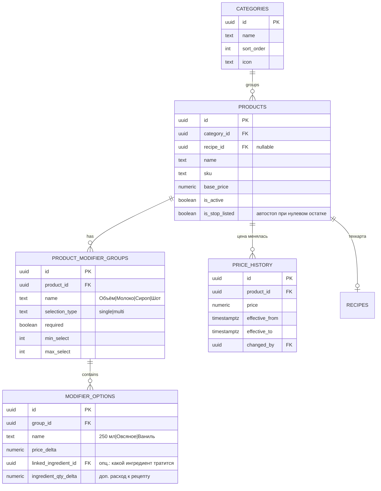
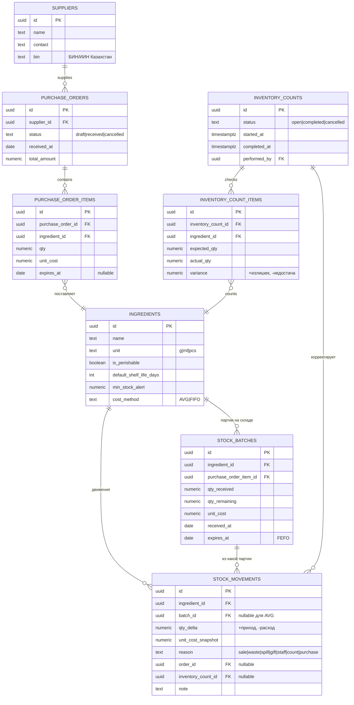
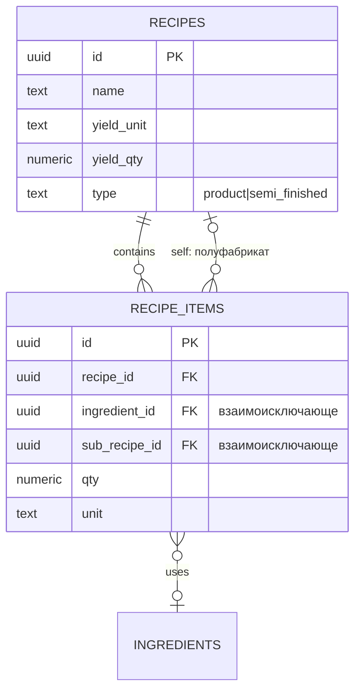
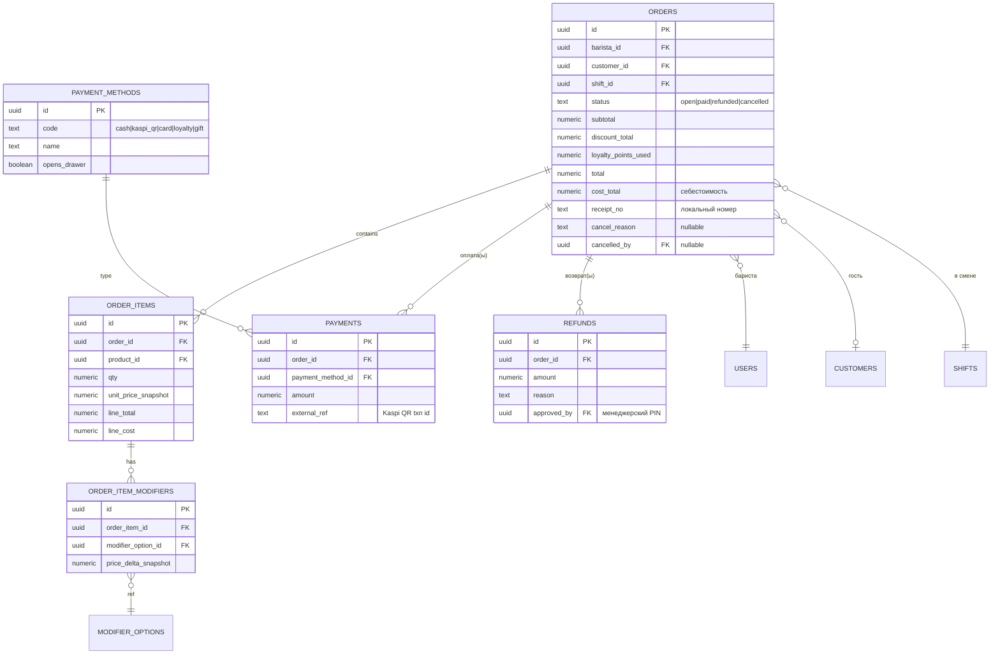
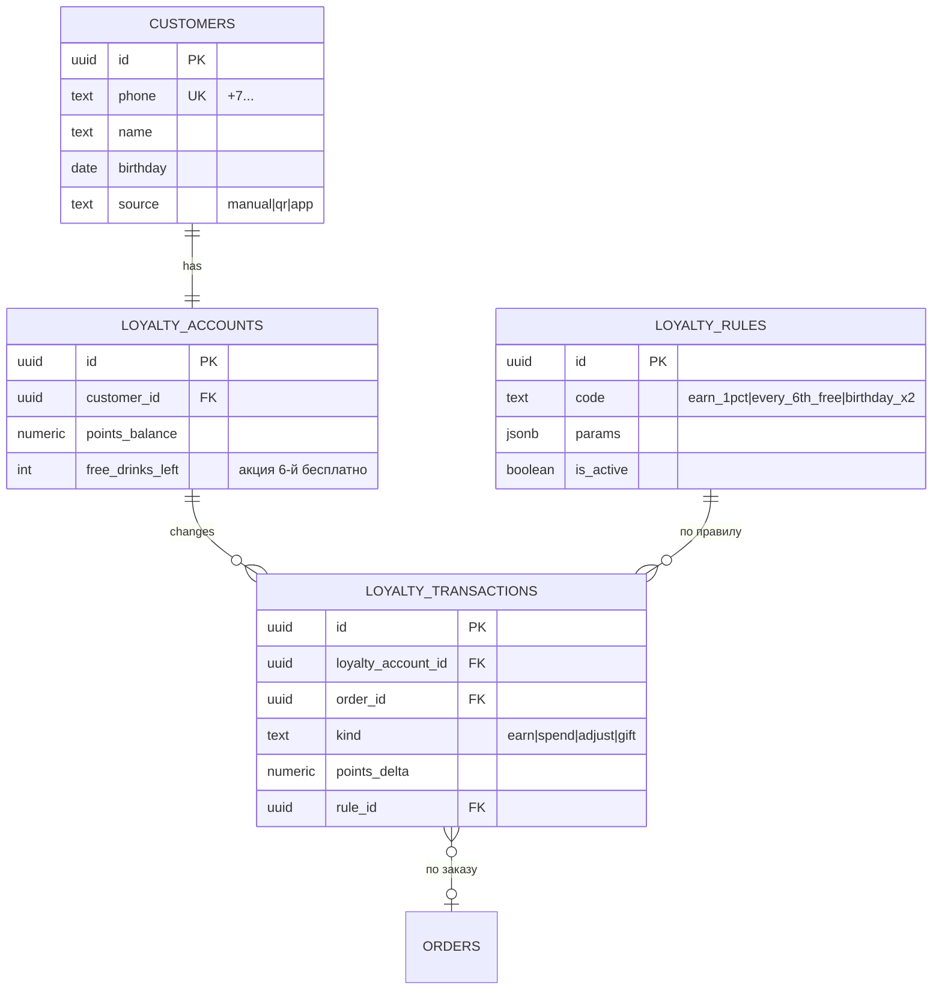
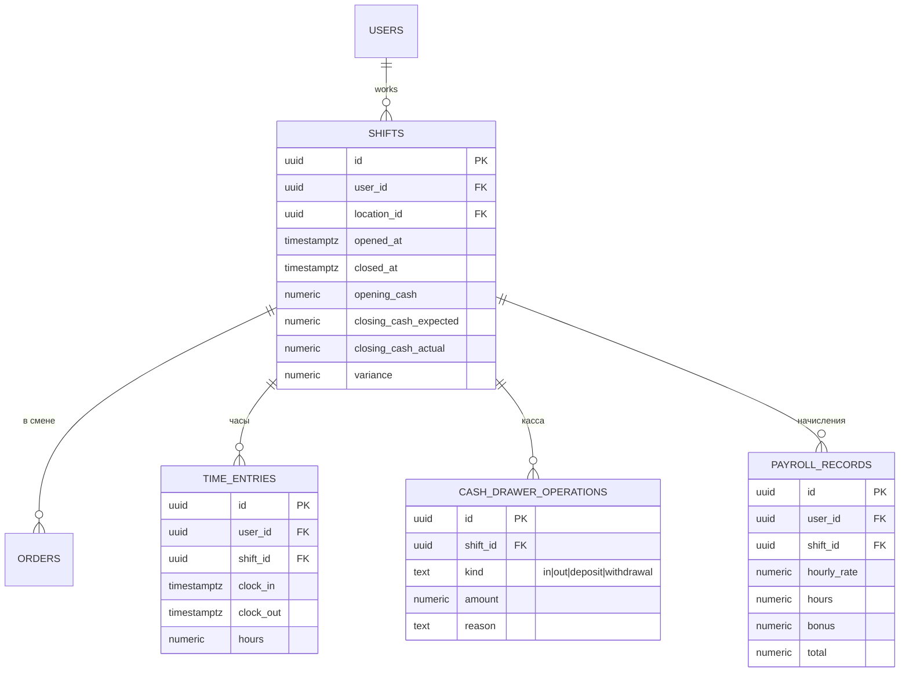
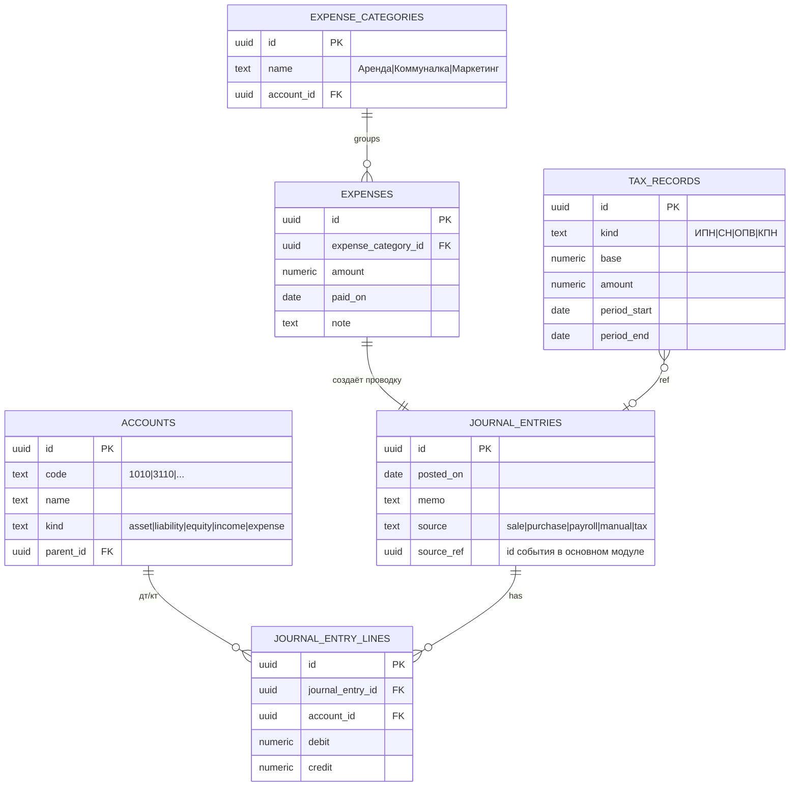
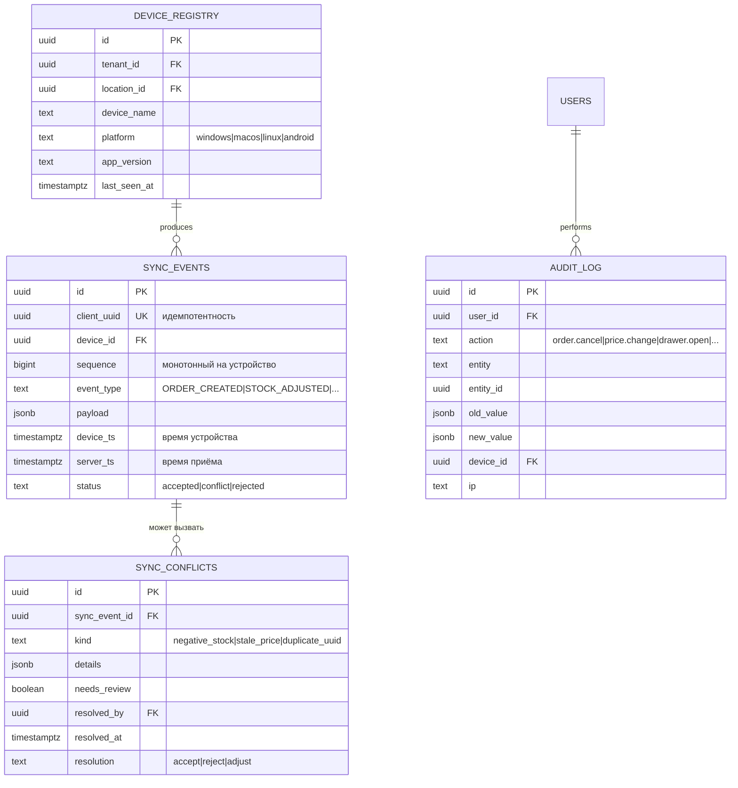

# 2. ER-диаграмма базы данных

Диаграмма разбита на **9 логических блоков** для читаемости. Все
бизнес-таблицы имеют обязательные поля:

```
tenant_id     UUID    NOT NULL  -- мультиточечность, RLS-ключ
location_id   UUID    NOT NULL  -- торговая точка
created_at    TIMESTAMPTZ NOT NULL DEFAULT now()
updated_at    TIMESTAMPTZ NOT NULL DEFAULT now()
deleted_at    TIMESTAMPTZ NULL          -- soft delete
created_by    UUID    NOT NULL           -- автор операции
client_uuid   UUID    NOT NULL UNIQUE    -- идемпотентность при sync
```

В диаграммах ниже эти поля опущены для краткости.

## 2.1 Организация и доступ



## 2.2 Меню, модификаторы, цены



## 2.3 Склад, поставки, движения



## 2.4 Рецепты и полуфабрикаты



**Правило целостности:** в каждом `recipe_items` ровно одно из
`ingredient_id` / `sub_recipe_id` заполнено (`CHECK` в SQL миграции).

## 2.5 Касса, заказы, оплаты, возвраты



## 2.6 CRM и программа лояльности



## 2.7 Смены и расчёты с персоналом



## 2.8 Бухгалтерия (изолированный модуль)



**Изоляция:** ни одна из таблиц выше **не имеет внешних ключей** в
таблицы продаж/склада. Связь только через `journal_entries.source_ref`
(soft reference — UUID без FK constraint).

## 2.9 Синхронизация и аудит



## 2.10 Индексы для горячих запросов

```sql
-- продажи
CREATE INDEX idx_orders_location_time   ON orders (location_id, created_at DESC);
CREATE INDEX idx_orders_customer        ON orders (customer_id) WHERE customer_id IS NOT NULL;
CREATE INDEX idx_orders_shift           ON orders (shift_id);

-- склад
CREATE INDEX idx_stock_movements_ingr_t ON stock_movements (ingredient_id, created_at DESC);
CREATE INDEX idx_stock_batches_fefo     ON stock_batches (ingredient_id, expires_at)
    WHERE qty_remaining > 0;

-- синхронизация
CREATE UNIQUE INDEX uq_sync_events_uuid ON sync_events (client_uuid);
CREATE INDEX idx_sync_events_device_seq ON sync_events (device_id, sequence);
CREATE INDEX idx_sync_events_status     ON sync_events (status) WHERE status <> 'accepted';

-- аудит
CREATE INDEX idx_audit_entity           ON audit_log (entity, entity_id);
CREATE INDEX idx_audit_user_time        ON audit_log (user_id, created_at DESC);

-- мультиточечность (RLS работает быстрее, когда tenant_id первый)
CREATE INDEX idx_products_tenant        ON products (tenant_id, is_active);
CREATE INDEX idx_orders_tenant_time     ON orders (tenant_id, created_at DESC);
```

## 2.11 Materialized views для аналитики

```sql
-- Часовая тепловая карта продаж (обновляется кроном раз в час)
CREATE MATERIALIZED VIEW mv_sales_heatmap AS
SELECT
    tenant_id,
    location_id,
    date_trunc('hour', created_at) AS hour_bucket,
    extract(dow  FROM created_at) AS weekday,
    extract(hour FROM created_at) AS hour_of_day,
    count(*)                       AS orders_count,
    sum(total)                     AS revenue,
    sum(total - cost_total)        AS margin
FROM orders
WHERE status = 'paid' AND deleted_at IS NULL
GROUP BY 1, 2, 3, 4, 5;

-- ABC-анализ товаров за период (параметризован через функцию)
CREATE MATERIALIZED VIEW mv_product_abc AS
SELECT
    tenant_id,
    location_id,
    product_id,
    sum(qty)                       AS units_sold,
    sum(line_total)                AS revenue,
    sum(line_total - line_cost)    AS margin,
    sum(line_total - line_cost)
        / NULLIF(sum(line_total), 0) AS margin_pct
FROM order_items oi
JOIN orders o ON o.id = oi.order_id
WHERE o.status = 'paid' AND o.created_at >= now() - interval '90 days'
GROUP BY 1, 2, 3;
```

## 2.12 Различия PostgreSQL vs SQLite

| Возможность | PostgreSQL (сервер) | SQLite (клиент) |
|---|---|---|
| `UUID` тип | нативный `uuid` | `TEXT` хранит UUIDv4 |
| `JSONB` | да, индексируется GIN | `TEXT` с JSON1-функциями |
| `TIMESTAMPTZ` | нативный | `TEXT` ISO-8601 UTC |
| `NUMERIC(12,4)` | нативный | `REAL` (достаточно для KZT) |
| RLS | да, `tenant_id` обязательно | нет — на клиенте только свой tenant |
| Materialized views | да | нет — считаем агрегаты на сервере и пуллим |
| Триггеры на бизнес-логике | **запрещены** | **запрещены** |

Миграции живут в двух наборах файлов, имена синхронизированы:
```
db/migrations/postgres/0001_init.up.sql
db/migrations/sqlite/0001_init.up.sql
```
Изменения схемы вносятся в **оба** файла в одном PR.

## 2.13 Открытые вопросы

1. **Себестоимость**: AVG по ингредиенту по умолчанию — подтвердить, или
   нужно выбирать FIFO для конкретных групп (зерно, молоко)?
2. **Лояльность**: одна программа на tenant, или у каждой локации своя?
3. **Налоги РК**: какие конкретно фиксируем? ИПН, СН, ОПВ, КПН — этого
   достаточно или нужны ещё (НДС если плательщик, ВОСМС)?
4. **Партии для готовой продукции** (полуфабрикаты): отслеживаем срок
   годности у самодельных сиропов или считаем «бесконечный»?
5. **Multi-currency**: KZT only или нужно закладывать USD/RUB для учёта
   импортных закупок?
