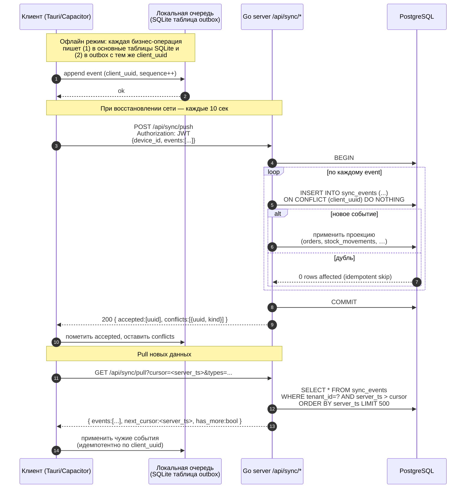

# 3. Go Sync Engine: модель, протокол, разрешение конфликтов

## 3.1 Что такое sync event

**Sync event** — это неизменяемая запись о бизнес-операции, произошедшей
на устройстве. Текущее состояние БД — это **проекция** последовательности
событий. Это event sourcing в облегчённой форме: события хранятся в
PostgreSQL и SQLite, но текущее состояние тоже материализовано в обычных
таблицах (orders, stock_movements и т.д.) — мы не пересчитываем всё с
нуля при каждом чтении.

### Поля события

| Поле | Тип | Назначение |
|---|---|---|
| `id` | UUID | PK на сервере (генерируется на стороне сервера) |
| `client_uuid` | UUID | **Идемпотентность.** Генерируется клиентом, UNIQUE |
| `device_id` | UUID | Устройство-источник из `device_registry` |
| `sequence` | bigint | Монотонный счётчик в рамках устройства |
| `event_type` | text | `ORDER_CREATED`, `STOCK_ADJUSTED`, `PRICE_CHANGED`, … |
| `payload` | jsonb | Тело события — все поля доменного объекта |
| `device_ts` | timestamptz | Время по часам устройства (может «уехать») |
| `server_ts` | timestamptz | Когда сервер принял событие |
| `status` | text | `pending` / `accepted` / `conflict` / `rejected` |
| `tenant_id`, `location_id` | UUID | Мультиточечность (RLS) |

### Каталог типов событий (MVP)

```
ORDER_CREATED              ← продажа на кассе
ORDER_REFUNDED             ← возврат (с PIN менеджера)
ORDER_CANCELLED            ← отмена
STOCK_RECEIVED             ← приходная накладная
STOCK_ADJUSTED             ← инвентаризация / ручная коррекция
STOCK_WRITTEN_OFF          ← брак / пролив / угощение
PRICE_CHANGED              ← изменение цены товара
MENU_PUBLISHED             ← новая версия меню (только админка)
SHIFT_OPENED / SHIFT_CLOSED
CASH_DRAWER_OP             ← внесение / изъятие
LOYALTY_EARNED / LOYALTY_SPENT
RECIPE_UPDATED
```

Все типы версионируются полем в payload `"_v": 1` — это даст спокойно
эволюционировать схему событий без слома старых клиентов.

## 3.2 Протокол: push + pull



### Endpoints (REST)

```
POST   /api/sync/push      — пуш накопленных событий
GET    /api/sync/pull      — пулл новых событий с курсором
GET    /api/sync/snapshot  — полный слепок состояния (для первого запуска
                              или после долгого офлайна > 7 дней)
GET    /api/sync/conflicts — список конфликтов с needs_review=true
POST   /api/sync/conflicts/:id/resolve — админ разрешает конфликт
GET    /api/devices/me     — какой я device, какие лимиты
POST   /api/devices/heartbeat — last_seen_at, версия приложения
```

Все запросы несут JWT с `tenant_id`, `location_id`, `user_id`, `device_id`,
`role`. Go middleware читает claims, ставит `SET LOCAL app.tenant_id`
для RLS, и проверяет права (`permissions.code`).

## 3.3 Идемпотентность

**Гарантия**: при любом числе повторов одного и того же `client_uuid`
сервер останется в том же состоянии, что и после первого приёма.

Реализуется на уровне БД:
```sql
CREATE UNIQUE INDEX uq_sync_events_uuid ON sync_events (client_uuid);
```
плюс `INSERT ... ON CONFLICT (client_uuid) DO NOTHING` в каждой
обработке события.

Доменные проекции (например, `INSERT INTO orders`) тоже идемпотентны
через тот же `client_uuid`, который хранится в `orders.client_uuid`
с UNIQUE constraint. Если событие уже было обработано — `INSERT`
проваливается, и мы не дублируем заказ.

### Почему `client_uuid`, а не `(device_id, sequence)`?

`sequence` уникален только в пределах устройства. `client_uuid` —
глобальный, и не зависит от того, какой device его создал (важно для
случаев, когда у бариста сменился планшет, но события из локальной
очереди надо отправить со старого устройства).

## 3.4 Стратегии разрешения конфликтов

Конфликт фиксируется, когда событие *технически принято*, но
**нарушает бизнес-инвариант**. Бариста при этом **не блокируется** —
заказ принят, чек напечатан, деньги получены. Администратор позже
разрешает конфликт.

| Конфликт | Когда возникает | Стратегия | Кто решает |
|---|---|---|---|
| `negative_stock` | Списание уводит остаток < 0 (двое продали последний капучино одновременно) | Записать движение, остаток уйдёт в минус, флаг `needs_review=true`. Бариста уже отдал кофе — отменять поздно. | Админ: либо подтверждает фактический излишек, либо вычитает из инвентаризации |
| `stale_price` | Заказ создан со старой ценой, потому что клиент не успел пулить обновление | Принять цену клиента (snapshot уже в order_items.unit_price_snapshot). Новая цена применится к следующим заказам. | Никто, авто-resolve |
| `duplicate_uuid` | `client_uuid` уже есть в БД | Skip — событие считается доставленным | Никто, авто-resolve |
| `unknown_product` | Бариста продал товар, который админ удалил с другого устройства | Принять, но пометить `needs_review`. Soft-deleted продукт остаётся в orders по FK (CASCADE запрещён). | Админ: переименовать или подтвердить |
| `clock_skew` | `device_ts` отличается от `server_ts` > 24ч | Использовать `server_ts` для отчётов; `device_ts` хранить как есть | Никто, фиксируется в audit |
| `shift_not_open` | Заказ пришёл с устройства без открытой смены | Открыть техническую смену с пометкой `auto_opened=true` | Менеджер при закрытии дня |

### Алгоритм для negative_stock (детально)

```
1. SyncService.applyOrderCreated(event):
2.   BEGIN
3.   INSERT INTO orders (...)
4.   INSERT INTO order_items (...)
5.   FOR each ingredient consumed:
6.       SELECT current_qty FROM v_ingredient_balance WHERE ingredient_id=?
7.       INSERT INTO stock_movements (qty_delta=-X, ...)
8.       IF current_qty - X < 0:
9.           INSERT INTO sync_conflicts (
10.              kind='negative_stock',
11.              needs_review=true,
12.              details = {ingredient, required, available}
13.          )
14.  COMMIT
```

Никаких триггеров, никакого rollback — событие зафиксировано, конфликт
зафиксирован отдельно, админ видит alert в дашборде.

## 3.5 Pull-cursor и upset (sub-feed)

**Pull** работает по курсору `server_ts`. Клиент шлёт последний
`server_ts`, который он уже видел, сервер возвращает события строго
после этого момента. Чтобы избежать гонок при равных `server_ts`
у нескольких событий, кортеж курсора — `(server_ts, sync_events.id)`:

```sql
WHERE (server_ts, id) > ($1, $2)
ORDER BY server_ts, id
LIMIT 500;
```

Клиент после применения сохраняет новый курсор. Лимит 500 событий
за раз — защита от больших пакетов и таймаутов.

## 3.6 Snapshot (первый запуск или > 7 дней офлайн)

Если устройство офлайн дольше TTL (по умолчанию 7 дней), pull может
вернуть слишком много событий. Тогда клиент запрашивает **snapshot**:

```
GET /api/sync/snapshot
→ {
    products: [...],          ← актуальное меню
    prices: [...],
    ingredients_stock: [...], ← остатки на момент server_ts
    cursor: <server_ts>,
    truncated_event_log: true ← клиент знает, что историю он не догонит
  }
```

После snapshot устройство больше не пытается восстановить полную
историю — оно работает «с нуля» от текущего курсора. Старые офлайн-события
с этого устройства всё равно будут проиграны при следующем push
(идемпотентно).

## 3.7 Часы и порядок

**Не доверяем `device_ts`** — у планшетов часы могут уехать на часы.
Для отчётов и аналитики используется `server_ts`. `device_ts` хранится
для аудита и debug.

`sequence` монотонно растёт **в рамках одного устройства**. Это даёт
гарантию: события одного устройства применяются в правильном порядке.
Между устройствами порядок определяется `server_ts` — кто первый
успел запушить, тот и впереди.

Это сознательный компромисс: мы не реализуем CRDT и не пытаемся
строить «глобально согласованную истину». Real-time бизнес кофейни
не требует строгой консистентности — достаточно eventually consistent
с явными конфликтами для админа.

## 3.8 Локальная очередь (outbox) в SQLite

```
outbox (
  client_uuid TEXT PK,
  sequence INTEGER NOT NULL,
  event_type TEXT NOT NULL,
  payload TEXT NOT NULL,           -- JSON
  device_ts TEXT NOT NULL,
  status TEXT NOT NULL,            -- 'pending' | 'sent' | 'accepted' | 'conflict'
  retry_count INTEGER DEFAULT 0,
  last_error TEXT,
  created_at TEXT NOT NULL
);
CREATE INDEX idx_outbox_status ON outbox(status, created_at);
```

Sync worker (Go в десктопе, JS в Capacitor):

1. Каждые 10 сек или по событию `network.online`:
   - читает `status='pending'` пачкой по 50,
   - POST `/api/sync/push`,
   - помечает `accepted` (удаляет через 7 дней — keep audit) или
     `conflict` (оставляет на ручной разбор админом).
2. После push — pull.
3. Если HTTP-ошибка: `retry_count++`, экспоненциальный backoff (1, 2, 4,
   8, 16, 32, 64 сек, потом каждые 60 сек), `last_error` обновляется.

## 3.9 Безопасность

- **JWT**: HS256, секрет в env-переменной, TTL 8 часов (длина смены),
  refresh-токен опционально.
- **PIN-вход**: bcrypt cost 12, проверка только локально (на сервере при
  online) — офлайн вход бариста разрешён.
- **TLS**: cloud — Let's Encrypt через Fly.io / Caddy reverse proxy. На
  локальном сервере администратор использует self-signed cert,
  Tauri/Capacitor доверяют ему через `certificateHashes` в конфиге.
- **Rate-limit на /api/sync/push**: 100 req/мин на устройство —
  защищает от взбесившегося клиента.
- **RLS**: `CREATE POLICY tenant_isolation ON orders USING
  (tenant_id = current_setting('app.tenant_id')::uuid)` на каждой
  бизнес-таблице.

## 3.10 Что НЕ делает sync engine (явные ограничения)

- **Нет real-time канала** (WebSocket / SSE). Pull — polling. Если
  понадобится «новые заказы появляются у админа мгновенно», добавим
  SSE-endpoint позже, но он не критичен для MVP.
- **Нет глобального ordering между устройствами** — только по
  `server_ts`. Если два бариста списали последний стакан одновременно,
  один уйдёт в минус. Это **фича**, не баг.
- **Нет автоматического merge**. Конфликты решает админ или
  авто-resolver по фиксированному правилу (см. таблицу §3.4).
- **Нет CRDT, нет vector clocks** — это была бы over-engineering для
  кофейни на 5 устройств.

## 3.11 Открытые вопросы

1. **Snapshot TTL**: 7 дней — норм? Если кофейня закрывается на
   праздники (10 дней) и потом обновляется — snapshot включится.
2. **Retention sync_events**: храним вечно (нужно для аудита и
   повторного проигрывания) или архивируем в R2 через 90 дней?
3. **WebSocket для админа**: нужен ли live-feed заказов в реальном
   времени для админа, или достаточно pull раз в 5 сек?
4. **Конфликт `unknown_product`**: что если админ удалил товар и
   через час бариста (офлайн) пробил его — какой UX у бариста при
   синке: «товар Х больше не существует, заказ переоформлен на …»?
